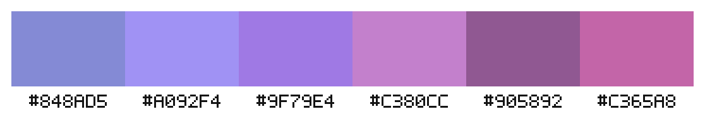
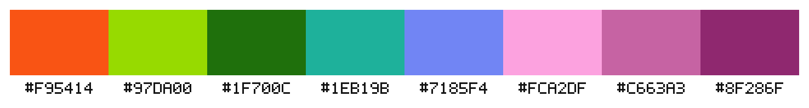
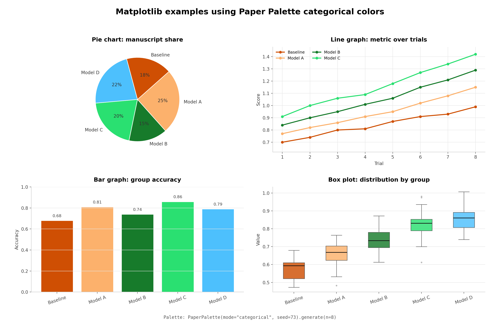
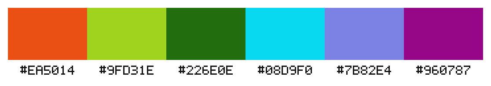
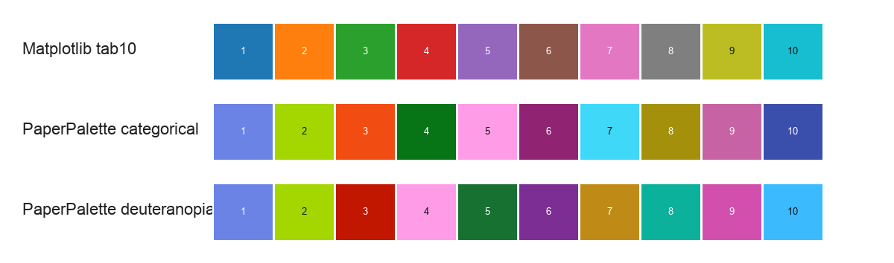

# Paper Palette

[English](README.md) | [한국어](README.ko.md) | [日本語](README.ja.md) | [简体中文](README.zh-CN.md)

Paper Palette 是一個用來產生色彩調色盤的 Python 函式庫，也提供輕量的桌面 UI。
它面向論文圖表、資料視覺化與簡報素材，使用 OKLab/OKLCH 等感知色彩空間，
並支援色覺差異條件下的配色檢查。

- `aesthetic`：適合 UI、簡報與設計的整體風格調色盤
- `categorical`：適合論文圖表、分組資料與類別比較的高區分度調色盤

函式庫永遠回傳大寫 `#RRGGBB` 字串。你可以把使用者指定的顏色固定在結果前面，
再讓演算法補齊剩餘顏色。新產生的顏色會依 OKLCH hue 排序，因此相鄰色塊通常會
呈現接近紅、橙、黃、綠、藍、紫的視覺順序。

## 範例

**Aesthetic 調色盤**



```python
PaperPalette(mode="aesthetic", seed=42).generate(n=6)
```

**Categorical 調色盤**



```python
PaperPalette(mode="categorical", seed=42).generate(n=8)
```

**Matplotlib categorical 圖表示例**



```python
import matplotlib.pyplot as plt
from paper_palette import PaperPalette

colors = PaperPalette(mode="categorical", seed=73).generate(n=8)

plt.pie([24, 18, 21, 14, 23], colors=colors[:5])
plt.show()
```

**考慮色覺差異的 categorical 調色盤**



```python
PaperPalette(mode="categorical", colorblind="deuteranopia", seed=42).generate(n=6)
```

**Observable 預設**


```python
from paper_palette import preset_colors

preset_colors("observable")
```

## 功能

- 使用 `mode="aesthetic"` 產生風格一致的設計調色盤。
- 使用 `mode="categorical"` 產生適合圖表和分組資料的高區分度調色盤。
- 可以保留使用者輸入的顏色，只補齊剩餘顏色。
- 依 OKLCH hue 排序新產生的顏色，讓視覺瀏覽更直覺。
- 支援 protanopia、deuteranopia、tritanopia、achromatopsia。
- categorical 模式會考慮顏色名稱分離、灰階/明度分離，以及白色或深色背景對比。
- 內建適合論文圖表的期刊風格預設。
- 提供 Tkinter 桌面 UI。
- 不依賴額外影像函式庫即可儲存 PNG 預覽。

## 安裝

先從 GitHub 下載專案：

```bash
git clone https://github.com/SemanticWave-Hoyeon/paper-palette.git
cd paper-palette
```

建議使用虛擬環境：

```bash
python3 -m venv .venv
source .venv/bin/activate
```

Windows PowerShell：

```powershell
.\.venv\Scripts\Activate.ps1
```

在專案根目錄安裝：

```bash
python3 -m pip install -e .
```

這會安裝 `paper_palette` 套件與 `paper-palette-ui` 指令。如果想先明確安裝依賴：

```bash
python3 -m pip install -r requirements.txt
python3 -m pip install -e .
```

確認函式庫可用：

```bash
python3 - <<'PY'
from paper_palette import PaperPalette
print(PaperPalette(mode="categorical", seed=42).generate(n=5))
PY
```

啟動桌面 UI：

```bash
paper-palette-ui
```

開發時安裝測試依賴：

```bash
python3 -m pip install -r requirements-dev.txt
python3 -m pip install -e .
python3 -m pytest -q
```

## 函式庫用法

匯入主要產生器：

```python
from paper_palette import PaperPalette
```

產生風格一致的設計調色盤：

```python
colors = PaperPalette(mode="aesthetic", seed=42).generate(n=5)
print(colors)
```


產生高區分度圖表調色盤：

```python
colors = PaperPalette(mode="categorical", seed=42).generate(n=8)
print(colors)
```


產生考慮色覺差異的 categorical 調色盤：

```python
colors = PaperPalette(
    mode="categorical",
    colorblind="deuteranopia",
    seed=42,
).generate(n=6)
```


為深色圖表背景產生調色盤：

```python
colors = PaperPalette(
    mode="categorical",
    background="dark",
    seed=42,
).generate(n=7)
```


使用者指定的顏色會保留在回傳結果前面：

```python
colors = PaperPalette(mode="aesthetic").generate(
    n=4,
    seed_colors=["#1E88E5"],
)
print(colors)
# ["#1E88E5", ...]
```


## 如何選擇模式

如果希望配色像一個統一主題，請使用 `aesthetic`：

```python
PaperPalette(mode="aesthetic").generate(n=6)
```

`aesthetic` 的預設值是 `harmony="stable"`。它會優先使用類似色與同一色調家族，
產生更穩定、更一致的調色盤。如果希望在仍然協調的前提下增加色相跨度，可以這樣寫：

```python
PaperPalette(mode="aesthetic", harmony="expressive").generate(n=6)
PaperPalette(mode="aesthetic", harmony="triadic").generate(n=6)
```

如果每種顏色代表不同類別、模型或實驗組，請使用 `categorical`：

```python
PaperPalette(mode="categorical").generate(n=6)
```

## 支援的選項

`colorblind`：

- `None`
- `"protanopia"`
- `"deuteranopia"`
- `"tritanopia"`
- `"achromatopsia"`

`background`：

- `"white"`
- `"black"`
- `"light"`
- `"dark"`

`harmony`，僅對 `mode="aesthetic"` 有意義：

- `"stable"`
- `"expressive"`
- `"analogous"`
- `"monochrome_accent"`
- `"split_complementary"`
- `"triadic"`

預設 `stable` 不啟用 split-complementary 與 triadic 模板，因為它們在小型 UI 或
簡報用調色盤中可能顯得不夠統一。需要更強的色相關係時，可以使用
`expressive` 或直接指定模板名。

## 預設

可以透過 public API 使用論文圖表風格的 categorical 預設：

```python
from paper_palette import PaperPalette, list_presets, preset_colors

list_presets()
preset_colors("observable", n=5)
PaperPalette(mode="categorical").preset("nejm", n=10)
```

包含的預設：

- `npg`
- `observable`
- `bmj`
- `jama`
- `science`
- `nejm`
- `lancet`
- `jco`
- `frontiers`
- `petroff6`
- `petroff8`
- `petroff10`

如果 `n` 大於預設顏色數量，Paper Palette 會先保留預設顏色，再產生相容的補充顏色。

## API 參考

| API | 用途 |
| --- | --- |
| `PaperPalette(mode="aesthetic", seed=None, colorblind=None, background="white", harmony="stable")` | 主要產生器。`Palette` 是較短的別名。 |
| `.generate(n, seed_colors=None)` | 回傳正好 `n` 個大寫 `#RRGGBB` 字串。 |
| `.preset(name, n=None, extend=True)` | 回傳命名預設。如果 `n` 大於預設且 `extend=True`，會在後面產生相容顏色。 |
| `list_presets()` | 回傳可用預設名稱。 |
| `preset_colors(name, n=None)` | 回傳正規化後的預設 HEX 字串。 |

`seed` 用於重現結果。`seed_colors` 會保留在結果前面，新產生的顏色會依感知 hue
排序。顏色輸入支援 `#RGB`、`#RRGGBB`、`#RRGGBBAA`，輸出始終正規化為大寫
`#RRGGBB`。無效輸入會拋出 `ValueError`。

## 比較與品質



Paper Palette 並不是為了取代 `colorspace` 這類完整色彩科學函式庫。它的重點是：
在一個小型 Python 套件中方便地產生論文圖表用 categorical 調色盤、擴充預設，
並透過輕量桌面 UI 固定顏色。

OKLab 距離、色覺模擬後的距離、背景對比與執行時間測量請見
[docs/QUALITY.md](docs/QUALITY.md)。

## 桌面 UI


## Web UI

瀏覽器版 UI 會以靜態 GitHub Pages 網站執行：

```text
https://semanticwave-hoyeon.github.io/paper-palette/
```

GitHub Pages 會託管 HTML、CSS 和 JavaScript 等靜態檔案。因此 Web UI 不是在
Python 伺服器上執行，而是在瀏覽器中產生調色盤。它支援產生調色盤、套用預設、
鎖定顏色、使用瀏覽器色彩選擇器編輯、複製 Python 陣列字串以及儲存 PNG。

本地預覽：

```bash
python3 -m http.server 8000 --directory docs
```

然後開啟 `http://localhost:8000`。

執行：

```bash
paper-palette-ui
```

本地開發時也可以執行：

```bash
python3 paper_palette_ui.py
python3 palette_ui.py
```

UI 支援設定 `n`、套用預設、隨機產生、選擇背景、鎖定色塊、雙擊編輯 HEX 顏色、
將 PNG 儲存到 `outputs/`，以及把目前調色盤複製為 Python 陣列字串。

## 演算法

Paper Palette 內部使用 OKLab/OKLCH，使距離與協調性評分比 RGB 或 HSV 更接近
人類感知。

`aesthetic` 模式會產生許多候選調色盤，再依整體分數選擇。預設使用類似色與同一色調
家族，並同時考慮 hue 一致性、明度對比、彩度平衡、中性色/強調色比例、避免重複，
以及對混濁或過度鮮豔顏色的懲罰。

`categorical` 模式使用類似 Glasbey 的 greedy farthest-point 策略，在感知色彩空間中
依序選擇距離既有顏色盡量遠的新顏色。評分中也包含顏色名稱分離、灰階列印時的明度差，
以及與所選 `background` 的對比。

## 授權

Paper Palette 使用 [MIT License](LICENSE) 發布。

## 開發

```bash
python3 -m pip install -r requirements-dev.txt
python3 -m pip install -e .
python3 -m pytest -q
python3 -m compileall -q src paper_palette_ui.py palette_ui.py
```
